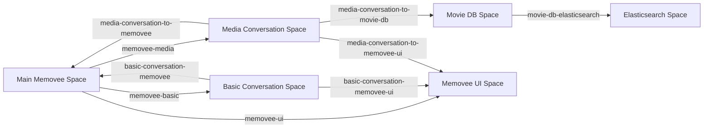

# Memovee Tama

## Summary

This repository contains the Terraform configuration for the Memovee Tama application, which provides a comprehensive AI-powered conversational platform integrating with various services including Tama, Mistral, X.ai, and Elasticsearch. The system supports advanced features like personalized conversations, media handling, and intelligent message routing.

## Table of Contents

- [Overview](#overview)
- [Core Components](#core-components)
- [Architecture](#architecture)
- [Key Modules](#key-modules)
- [Space Relationships](#space-relationships)
- [Documentation](#documentation)
- [Getting Started](#getting-started)

## Overview

The Memovee Tama system is designed to create an intelligent conversational AI platform that can handle:
- Personalized conversations with user profiles
- Media-related interactions
- Message routing and classification
- Contextual awareness and memory
- Integration with external AI services

## Core Components

### Main Module
- Core memovee messaging module serving as the primary interface
- Reply generation chain with associated processors
- Configuration for handling reply generation with specific models and contexts

### Models

All models referenced via *_model_id, *_model_parameters, and tama_thought_processor resources:

| Function | Model | Temperature | Reasoning effort | Service tier |
| --- | --- | --- | --- | --- |
| Memovee - Reply Generation | gpt-5-mini | 1.0 | low |  |
| Router - Message Routing | gpt-5-mini | 1.0 | minimal |  |
| Elasticsearch - Index Mapping Generation | gpt-5 | 1.0 | low |  |
| Index Definition Generation | gpt-5 | 1.0 | low |  |
| Movie DB - Generate Description | gpt-5-nano | 1.0 | low | flex |
| Movie DB - Generate Setting | gpt-5-nano | 1.0 | low | flex |
| Media Browsing - Tool Call | gpt-5-mini | 1.0 | minimal |  |
| Media Detail - Tool Call | gpt-5 | 1.0 | minimal |  |
| Person Browsing - Tool Call | gpt-5-mini | 1.0 | minimal |  |
| Person Detail - Tool Call | gpt-5 | 1.0 | minimal |  |
| Memovee - Artifact Creation | gpt-5-mini | 1.0 | low |  |
| Basic - Check Profile Tooling | gpt-5 | 1.0 | minimal |  |
| Basic - Upsert Profile Tooling | gpt-5 | 1.0 | minimal |  |

### Data Storage
- Elasticsearch module for indexing and searching capabilities
- Personalization and prompt assembly spaces

## Architecture

The system is built with a modular architecture that allows for flexible extension and maintenance of different conversational functionalities.

## Key Modules

- **Main**: Core memovee functionality and interfaces
- **Basic**: Basic conversation handling with off-topic, greeting, and introductory flows
- **Media**: Media-related conversation components
- **Personalization**: User-specific content management
- **Prompt Assembly**: Contextual information assembly
- **Router**: Message classification and routing
- **Movie Database**: Movie information integration

## Space Relationships

The following diagram shows the correct relationships between Tama spaces in the system, based on the actual `tama_space_bridge` resource definitions:

## Documentation

For detailed information about the various components of the Memovee Tama system, please refer to the following documentation files:

- [Main Module Documentation](docs/main.md)
- [Movie Database Documentation](docs/movie-db.md)
- [Personalization Documentation](docs/personalization.md)
- [Router Module Documentation](docs/router.md)

## Getting Started

To get started with the Memovee Tama project, you'll need to:
1. Set up your environment with the required Terraform version (v1.0.0+)
2. Configure API keys for external services (Tama, Mistral, X.ai, Elasticsearch)
3. Create a `.auto.tfvars` file with your configuration values
4. Run `terraform init`, `terraform plan`, and `terraform apply`

<!-- BEGIN_TF_DOCS -->

## Requirements

| Name | Version |
|------|---------|
|  [terraform](#requirement\_terraform) | >= 1.0.0 |
|  [tama](#requirement\_tama) | ~> 0.4 |

## Providers

| Name | Version |
|------|---------|
|  [http](#provider\_http) | 3.5.0 |
|  [tama](#provider\_tama) | 0.4.2 |

## Modules

| Name | Source | Version |
|------|--------|---------|
|  [artifact-context](#module\_artifact-context) | upmaru/base/tama//modules/thought-context | 0.4.0 |
|  [check-profile-tooling](#module\_check-profile-tooling) | upmaru/base/tama//modules/tooling | 0.4.0 |
|  [elasticsearch](#module\_elasticsearch) | upmaru/base/tama//modules/elasticsearch | 0.4.0 |
|  [extract-embed-basic-conversation](#module\_extract-embed-basic-conversation) | upmaru/base/tama//modules/extract-embed | 0.4.0 |
|  [global](#module\_global) | upmaru/base/tama | 0.4.0 |
|  [index-definition-generation](#module\_index-definition-generation) | ./modules/index-definition | n/a |
|  [index-mapping-generation](#module\_index-mapping-generation) | ./modules/index-mapping | n/a |
|  [media-browsing](#module\_media-browsing) | ./modules/media-conversate | n/a |
|  [media-conversation](#module\_media-conversation) | ./modules/media-space | n/a |
|  [media-detail](#module\_media-detail) | ./modules/media-conversate | n/a |
|  [memovee](#module\_memovee) | upmaru/base/tama//modules/messaging | 0.4.0 |
|  [mistral](#module\_mistral) | upmaru/base/tama//modules/inference-service | 0.4.0 |
|  [movie-db](#module\_movie-db) | ./modules/movie-db | n/a |
|  [openai](#module\_openai) | upmaru/base/tama//modules/inference-service | 0.4.0 |
|  [person-browsing](#module\_person-browsing) | ./modules/media-conversate | n/a |
|  [person-detail](#module\_person-detail) | ./modules/media-conversate | n/a |
|  [reply-context](#module\_reply-context) | upmaru/base/tama//modules/thought-context | 0.4.0 |
|  [router](#module\_router) | upmaru/base/tama//modules/router | 0.4.0 |
|  [update-user-perference](#module\_update-user-perference) | upmaru/base/tama//modules/tooling | 0.4.0 |
|  [upsert-profile-tooling](#module\_upsert-profile-tooling) | upmaru/base/tama//modules/tooling | 0.4.0 |
|  [voyageai](#module\_voyageai) | upmaru/base/tama//modules/inference-service | 0.4.0 |
|  [watch-providers](#module\_watch-providers) | ./modules/watch-providers | n/a |
|  [xai](#module\_xai) | upmaru/base/tama//modules/inference-service | 0.4.0 |

## Resources

| Name | Type |
|------|------|
| [tama_chain.curse](https://registry.terraform.io/providers/upmaru/tama/latest/docs/resources/chain) | resource |
| [tama_chain.handle-personalization](https://registry.terraform.io/providers/upmaru/tama/latest/docs/resources/chain) | resource |
| [tama_chain.load-profile-and-greet](https://registry.terraform.io/providers/upmaru/tama/latest/docs/resources/chain) | resource |
| [tama_chain.manipulation](https://registry.terraform.io/providers/upmaru/tama/latest/docs/resources/chain) | resource |
| [tama_chain.off-topic](https://registry.terraform.io/providers/upmaru/tama/latest/docs/resources/chain) | resource |
| [tama_chain.patch-reply](https://registry.terraform.io/providers/upmaru/tama/latest/docs/resources/chain) | resource |
| [tama_chain.reply-generation](https://registry.terraform.io/providers/upmaru/tama/latest/docs/resources/chain) | resource |
| [tama_chain.upsert-profile](https://registry.terraform.io/providers/upmaru/tama/latest/docs/resources/chain) | resource |
| [tama_class.curse](https://registry.terraform.io/providers/upmaru/tama/latest/docs/resources/class) | resource |
| [tama_class.greeting](https://registry.terraform.io/providers/upmaru/tama/latest/docs/resources/class) | resource |
| [tama_class.introductory](https://registry.terraform.io/providers/upmaru/tama/latest/docs/resources/class) | resource |
| [tama_class.manipulation](https://registry.terraform.io/providers/upmaru/tama/latest/docs/resources/class) | resource |
| [tama_class.off-topic](https://registry.terraform.io/providers/upmaru/tama/latest/docs/resources/class) | resource |
| [tama_class.patch](https://registry.terraform.io/providers/upmaru/tama/latest/docs/resources/class) | resource |
| [tama_class.personalization](https://registry.terraform.io/providers/upmaru/tama/latest/docs/resources/class) | resource |
| [tama_listener.memovee-ui-listener](https://registry.terraform.io/providers/upmaru/tama/latest/docs/resources/listener) | resource |
| [tama_listener_filter.curse](https://registry.terraform.io/providers/upmaru/tama/latest/docs/resources/listener_filter) | resource |
| [tama_listener_filter.load-profile-and-greet](https://registry.terraform.io/providers/upmaru/tama/latest/docs/resources/listener_filter) | resource |
| [tama_listener_filter.manipulation](https://registry.terraform.io/providers/upmaru/tama/latest/docs/resources/listener_filter) | resource |
| [tama_listener_filter.media-browsing](https://registry.terraform.io/providers/upmaru/tama/latest/docs/resources/listener_filter) | resource |
| [tama_listener_filter.media-detail](https://registry.terraform.io/providers/upmaru/tama/latest/docs/resources/listener_filter) | resource |
| [tama_listener_filter.off-topic](https://registry.terraform.io/providers/upmaru/tama/latest/docs/resources/listener_filter) | resource |
| [tama_listener_filter.patch-reply](https://registry.terraform.io/providers/upmaru/tama/latest/docs/resources/listener_filter) | resource |
| [tama_listener_filter.person-browsing](https://registry.terraform.io/providers/upmaru/tama/latest/docs/resources/listener_filter) | resource |
| [tama_listener_filter.person-detail](https://registry.terraform.io/providers/upmaru/tama/latest/docs/resources/listener_filter) | resource |
| [tama_listener_filter.personalization](https://registry.terraform.io/providers/upmaru/tama/latest/docs/resources/listener_filter) | resource |
| [tama_listener_filter.reply-generation](https://registry.terraform.io/providers/upmaru/tama/latest/docs/resources/listener_filter) | resource |
| [tama_listener_filter.upsert-profile](https://registry.terraform.io/providers/upmaru/tama/latest/docs/resources/listener_filter) | resource |
| [tama_listener_topic.user-message-topic](https://registry.terraform.io/providers/upmaru/tama/latest/docs/resources/listener_topic) | resource |
| [tama_modular_thought.forward-check-profile](https://registry.terraform.io/providers/upmaru/tama/latest/docs/resources/modular_thought) | resource |
| [tama_modular_thought.forward-curse](https://registry.terraform.io/providers/upmaru/tama/latest/docs/resources/modular_thought) | resource |
| [tama_modular_thought.forward-manipulation](https://registry.terraform.io/providers/upmaru/tama/latest/docs/resources/modular_thought) | resource |
| [tama_modular_thought.forward-off-topic](https://registry.terraform.io/providers/upmaru/tama/latest/docs/resources/modular_thought) | resource |
| [tama_modular_thought.forward-patch](https://registry.terraform.io/providers/upmaru/tama/latest/docs/resources/modular_thought) | resource |
| [tama_modular_thought.forward-personalization](https://registry.terraform.io/providers/upmaru/tama/latest/docs/resources/modular_thought) | resource |
| [tama_modular_thought.forward-upsert-profile](https://registry.terraform.io/providers/upmaru/tama/latest/docs/resources/modular_thought) | resource |
| [tama_modular_thought.reply-artifact](https://registry.terraform.io/providers/upmaru/tama/latest/docs/resources/modular_thought) | resource |
| [tama_modular_thought.reply-generation](https://registry.terraform.io/providers/upmaru/tama/latest/docs/resources/modular_thought) | resource |
| [tama_node.handle-check-profile](https://registry.terraform.io/providers/upmaru/tama/latest/docs/resources/node) | resource |
| [tama_node.handle-curse](https://registry.terraform.io/providers/upmaru/tama/latest/docs/resources/node) | resource |
| [tama_node.handle-manipulation](https://registry.terraform.io/providers/upmaru/tama/latest/docs/resources/node) | resource |
| [tama_node.handle-off-topic](https://registry.terraform.io/providers/upmaru/tama/latest/docs/resources/node) | resource |
| [tama_node.handle-patch](https://registry.terraform.io/providers/upmaru/tama/latest/docs/resources/node) | resource |
| [tama_node.handle-personalization](https://registry.terraform.io/providers/upmaru/tama/latest/docs/resources/node) | resource |
| [tama_node.handle-reply-generation](https://registry.terraform.io/providers/upmaru/tama/latest/docs/resources/node) | resource |
| [tama_node.handle-upsert-profile](https://registry.terraform.io/providers/upmaru/tama/latest/docs/resources/node) | resource |
| [tama_prompt.check-profile-reply](https://registry.terraform.io/providers/upmaru/tama/latest/docs/resources/prompt) | resource |
| [tama_prompt.check-profile-tooling](https://registry.terraform.io/providers/upmaru/tama/latest/docs/resources/prompt) | resource |
| [tama_prompt.curse-reply](https://registry.terraform.io/providers/upmaru/tama/latest/docs/resources/prompt) | resource |
| [tama_prompt.handle-personalization](https://registry.terraform.io/providers/upmaru/tama/latest/docs/resources/prompt) | resource |
| [tama_prompt.manipulation-reply](https://registry.terraform.io/providers/upmaru/tama/latest/docs/resources/prompt) | resource |
| [tama_prompt.media-browsing-reply](https://registry.terraform.io/providers/upmaru/tama/latest/docs/resources/prompt) | resource |
| [tama_prompt.media-browsing-tooling](https://registry.terraform.io/providers/upmaru/tama/latest/docs/resources/prompt) | resource |
| [tama_prompt.media-detail-reply](https://registry.terraform.io/providers/upmaru/tama/latest/docs/resources/prompt) | resource |
| [tama_prompt.media-detail-tooling](https://registry.terraform.io/providers/upmaru/tama/latest/docs/resources/prompt) | resource |
| [tama_prompt.memovee](https://registry.terraform.io/providers/upmaru/tama/latest/docs/resources/prompt) | resource |
| [tama_prompt.off-topic-reply](https://registry.terraform.io/providers/upmaru/tama/latest/docs/resources/prompt) | resource |
| [tama_prompt.patch-artifact](https://registry.terraform.io/providers/upmaru/tama/latest/docs/resources/prompt) | resource |
| [tama_prompt.patch-reply](https://registry.terraform.io/providers/upmaru/tama/latest/docs/resources/prompt) | resource |
| [tama_prompt.person-browse-reply](https://registry.terraform.io/providers/upmaru/tama/latest/docs/resources/prompt) | resource |
| [tama_prompt.person-browse-tooling](https://registry.terraform.io/providers/upmaru/tama/latest/docs/resources/prompt) | resource |
| [tama_prompt.person-detail-reply](https://registry.terraform.io/providers/upmaru/tama/latest/docs/resources/prompt) | resource |
| [tama_prompt.person-detail-tooling](https://registry.terraform.io/providers/upmaru/tama/latest/docs/resources/prompt) | resource |
| [tama_prompt.personalization-artifact](https://registry.terraform.io/providers/upmaru/tama/latest/docs/resources/prompt) | resource |
| [tama_prompt.personalization-reply](https://registry.terraform.io/providers/upmaru/tama/latest/docs/resources/prompt) | resource |
| [tama_prompt.reply-artifact](https://registry.terraform.io/providers/upmaru/tama/latest/docs/resources/prompt) | resource |
| [tama_prompt.reply-template](https://registry.terraform.io/providers/upmaru/tama/latest/docs/resources/prompt) | resource |
| [tama_prompt.upsert-profile-artifact](https://registry.terraform.io/providers/upmaru/tama/latest/docs/resources/prompt) | resource |
| [tama_prompt.upsert-profile-reply](https://registry.terraform.io/providers/upmaru/tama/latest/docs/resources/prompt) | resource |
| [tama_prompt.upsert-profile-tooling](https://registry.terraform.io/providers/upmaru/tama/latest/docs/resources/prompt) | resource |
| [tama_source_identity.memovee-ui-oauth](https://registry.terraform.io/providers/upmaru/tama/latest/docs/resources/source_identity) | resource |
| [tama_space.basic-conversation](https://registry.terraform.io/providers/upmaru/tama/latest/docs/resources/space) | resource |
| [tama_space.ui](https://registry.terraform.io/providers/upmaru/tama/latest/docs/resources/space) | resource |
| [tama_space_bridge.basic-conversation-memovee](https://registry.terraform.io/providers/upmaru/tama/latest/docs/resources/space_bridge) | resource |
| [tama_space_bridge.basic-conversation-memovee-ui](https://registry.terraform.io/providers/upmaru/tama/latest/docs/resources/space_bridge) | resource |
| [tama_space_bridge.memovee-basic](https://registry.terraform.io/providers/upmaru/tama/latest/docs/resources/space_bridge) | resource |
| [tama_space_bridge.memovee-media](https://registry.terraform.io/providers/upmaru/tama/latest/docs/resources/space_bridge) | resource |
| [tama_space_bridge.memovee-ui](https://registry.terraform.io/providers/upmaru/tama/latest/docs/resources/space_bridge) | resource |
| [tama_space_processor.default-completion](https://registry.terraform.io/providers/upmaru/tama/latest/docs/resources/space_processor) | resource |
| [tama_space_processor.default-embedding](https://registry.terraform.io/providers/upmaru/tama/latest/docs/resources/space_processor) | resource |
| [tama_space_processor.default-reranking](https://registry.terraform.io/providers/upmaru/tama/latest/docs/resources/space_processor) | resource |
| [tama_specification.memovee-ui](https://registry.terraform.io/providers/upmaru/tama/latest/docs/resources/specification) | resource |
| [tama_thought_path.check-profile-reply](https://registry.terraform.io/providers/upmaru/tama/latest/docs/resources/thought_path) | resource |
| [tama_thought_path.forward-curse-reply](https://registry.terraform.io/providers/upmaru/tama/latest/docs/resources/thought_path) | resource |
| [tama_thought_path.forward-manipulation-reply](https://registry.terraform.io/providers/upmaru/tama/latest/docs/resources/thought_path) | resource |
| [tama_thought_path.forward-off-topic-reply](https://registry.terraform.io/providers/upmaru/tama/latest/docs/resources/thought_path) | resource |
| [tama_thought_path.forward-patch-reply](https://registry.terraform.io/providers/upmaru/tama/latest/docs/resources/thought_path) | resource |
| [tama_thought_path.forward-personalization-reply](https://registry.terraform.io/providers/upmaru/tama/latest/docs/resources/thought_path) | resource |
| [tama_thought_path.forward-upsert-profile](https://registry.terraform.io/providers/upmaru/tama/latest/docs/resources/thought_path) | resource |
| [tama_thought_path.route-to-curse](https://registry.terraform.io/providers/upmaru/tama/latest/docs/resources/thought_path) | resource |
| [tama_thought_path.route-to-greeting](https://registry.terraform.io/providers/upmaru/tama/latest/docs/resources/thought_path) | resource |
| [tama_thought_path.route-to-introductory](https://registry.terraform.io/providers/upmaru/tama/latest/docs/resources/thought_path) | resource |
| [tama_thought_path.route-to-manipulation](https://registry.terraform.io/providers/upmaru/tama/latest/docs/resources/thought_path) | resource |
| [tama_thought_path.route-to-media-conversation-classes](https://registry.terraform.io/providers/upmaru/tama/latest/docs/resources/thought_path) | resource |
| [tama_thought_path.route-to-off-topic](https://registry.terraform.io/providers/upmaru/tama/latest/docs/resources/thought_path) | resource |
| [tama_thought_path.route-to-patch](https://registry.terraform.io/providers/upmaru/tama/latest/docs/resources/thought_path) | resource |
| [tama_thought_path.route-to-personalization](https://registry.terraform.io/providers/upmaru/tama/latest/docs/resources/thought_path) | resource |
| [tama_thought_path_directive.check-profile-reply](https://registry.terraform.io/providers/upmaru/tama/latest/docs/resources/thought_path_directive) | resource |
| [tama_thought_path_directive.curse-reply](https://registry.terraform.io/providers/upmaru/tama/latest/docs/resources/thought_path_directive) | resource |
| [tama_thought_path_directive.forward-patch-artifact](https://registry.terraform.io/providers/upmaru/tama/latest/docs/resources/thought_path_directive) | resource |
| [tama_thought_path_directive.forward-patch-reply](https://registry.terraform.io/providers/upmaru/tama/latest/docs/resources/thought_path_directive) | resource |
| [tama_thought_path_directive.manipulation-reply](https://registry.terraform.io/providers/upmaru/tama/latest/docs/resources/thought_path_directive) | resource |
| [tama_thought_path_directive.off-topic-reply](https://registry.terraform.io/providers/upmaru/tama/latest/docs/resources/thought_path_directive) | resource |
| [tama_thought_path_directive.personalization-artifact](https://registry.terraform.io/providers/upmaru/tama/latest/docs/resources/thought_path_directive) | resource |
| [tama_thought_path_directive.personalization-reply](https://registry.terraform.io/providers/upmaru/tama/latest/docs/resources/thought_path_directive) | resource |
| [tama_thought_path_directive.upsert-profile-artifact](https://registry.terraform.io/providers/upmaru/tama/latest/docs/resources/thought_path_directive) | resource |
| [tama_thought_path_directive.upsert-profile-reply](https://registry.terraform.io/providers/upmaru/tama/latest/docs/resources/thought_path_directive) | resource |
| [tama_thought_processor.artifact-processor](https://registry.terraform.io/providers/upmaru/tama/latest/docs/resources/thought_processor) | resource |
| [tama_thought_processor.reply-processor](https://registry.terraform.io/providers/upmaru/tama/latest/docs/resources/thought_processor) | resource |
| [tama_thought_tool.create-artifact-tool](https://registry.terraform.io/providers/upmaru/tama/latest/docs/resources/thought_tool) | resource |
| [tama_thought_tool.media-detail-check-user-preferences](https://registry.terraform.io/providers/upmaru/tama/latest/docs/resources/thought_tool) | resource |
| [tama_thought_tool.watch-providers](https://registry.terraform.io/providers/upmaru/tama/latest/docs/resources/thought_tool) | resource |
| [tama_thought_tool_output.watch-providers-output](https://registry.terraform.io/providers/upmaru/tama/latest/docs/resources/thought_tool_output) | resource |
| [tama_tool_output_option.watch-providers-region](https://registry.terraform.io/providers/upmaru/tama/latest/docs/resources/tool_output_option) | resource |
| [http_http.memovee-ui](https://registry.terraform.io/providers/hashicorp/http/latest/docs/data-sources/http) | data source |
| [tama_action.create-artifact](https://registry.terraform.io/providers/upmaru/tama/latest/docs/data-sources/action) | data source |
| [tama_action.create-user-preference](https://registry.terraform.io/providers/upmaru/tama/latest/docs/data-sources/action) | data source |
| [tama_action.get-user](https://registry.terraform.io/providers/upmaru/tama/latest/docs/data-sources/action) | data source |
| [tama_action.get-user-preferences](https://registry.terraform.io/providers/upmaru/tama/latest/docs/data-sources/action) | data source |
| [tama_action.update-user](https://registry.terraform.io/providers/upmaru/tama/latest/docs/data-sources/action) | data source |
| [tama_action.update-user-preference](https://registry.terraform.io/providers/upmaru/tama/latest/docs/data-sources/action) | data source |
| [tama_class.tool-call](https://registry.terraform.io/providers/upmaru/tama/latest/docs/data-sources/class) | data source |
| [tama_space.global](https://registry.terraform.io/providers/upmaru/tama/latest/docs/data-sources/space) | data source |

## Inputs

| Name | Description | Type | Default | Required |
|------|-------------|------|---------|:--------:|
|  [elasticsearch\_endpoint](#input\_elasticsearch\_endpoint) | n/a | `any` | n/a | yes |
|  [elasticsearch\_management\_api\_key](#input\_elasticsearch\_management\_api\_key) | n/a | `any` | n/a | yes |
|  [elasticsearch\_movie\_db\_api\_key](#input\_elasticsearch\_movie\_db\_api\_key) | n/a | `any` | n/a | yes |
|  [memovee\_listener\_secret](#input\_memovee\_listener\_secret) | n/a | `string` | n/a | yes |
|  [memovee\_ui\_client\_id](#input\_memovee\_ui\_client\_id) | n/a | `any` | n/a | yes |
|  [memovee\_ui\_client\_secret](#input\_memovee\_ui\_client\_secret) | n/a | `any` | n/a | yes |
|  [memovee\_ui\_endpoint](#input\_memovee\_ui\_endpoint) | n/a | `any` | n/a | yes |
|  [memovee\_ui\_openapi\_url](#input\_memovee\_ui\_openapi\_url) | n/a | `any` | n/a | yes |
|  [mistral\_api\_key](#input\_mistral\_api\_key) | n/a | `any` | n/a | yes |
|  [openai\_api\_key](#input\_openai\_api\_key) | n/a | `any` | n/a | yes |
|  [tama\_api\_key](#input\_tama\_api\_key) | n/a | `any` | n/a | yes |
|  [tama\_base\_url](#input\_tama\_base\_url) | n/a | `any` | n/a | yes |
|  [tmdb\_api\_key](#input\_tmdb\_api\_key) | n/a | `any` | n/a | yes |
|  [voyageai\_api\_key](#input\_voyageai\_api\_key) | n/a | `any` | n/a | yes |
|  [xai\_api\_key](#input\_xai\_api\_key) | n/a | `any` | n/a | yes |

## Outputs

No outputs.
<!-- END_TF_DOCS -->
