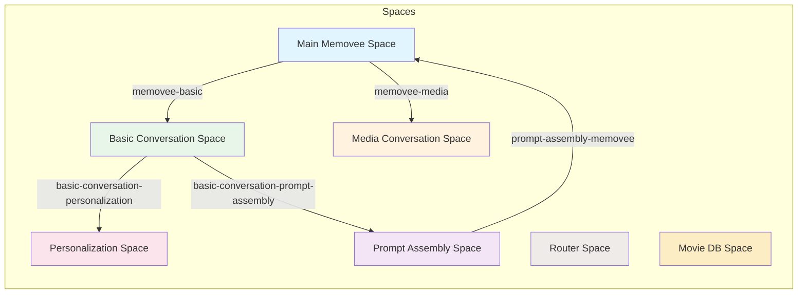

# Memovee Tama

## Summary

This repository contains the Terraform configuration for the Memovee Tama application, which provides a comprehensive AI-powered conversational platform integrating with various services including Tama, Mistral, X.ai, and Elasticsearch. The system supports advanced features like personalized conversations, media handling, and intelligent message routing.

## Table of Contents

- [Overview](#overview)
- [Core Components](#core-components)
- [Architecture](#architecture)
- [Key Modules](#key-modules)
- [Space Relationships](#space-relationships)
- [Getting Started](#getting-started)

## Overview

The Memovee Tama system is designed to create an intelligent conversational AI platform that can handle:
- Personalized conversations with user profiles
- Media-related interactions
- Message routing and classification
- Contextual awareness and memory
- Integration with external AI services

## Core Components

### Main Module
- Core memovee messaging module serving as the primary interface
- Reply generation chain with associated processors
- Configuration for handling reply generation with specific models and contexts

### Models
- Mistral module with `mistral-medium-latest` and `mistral-small-latest` models
- X.ai module with `grok-3-mini` and `grok-3-mini-fast` models

### Data Storage
- Elasticsearch module for indexing and searching capabilities
- Personalization and prompt assembly spaces

## Architecture

The system is built with a modular architecture that allows for flexible extension and maintenance of different conversational functionalities.

## Key Modules

- **Main**: Core memovee functionality and interfaces
- **Basic**: Basic conversation handling with off-topic, greeting, and introductory flows
- **Media**: Media-related conversation components
- **Personalization**: User-specific content management
- **Prompt Assembly**: Contextual information assembly
- **Router**: Message classification and routing
- **Movie Database**: Movie information integration

## Space Relationships

The following diagram shows the correct relationships between Tama spaces in the system, based on the actual `tama_space_bridge` resource definitions:

## Getting Started

To get started with the Memovee Tama project, you'll need to:
1. Set up your environment with the required Terraform version (v1.0.0+)
2. Configure API keys for external services (Tama, Mistral, X.ai, Elasticsearch)
3. Create a `.auto.tfvars` file with your configuration values
4. Run `terraform init`, `terraform plan`, and `terraform apply`
