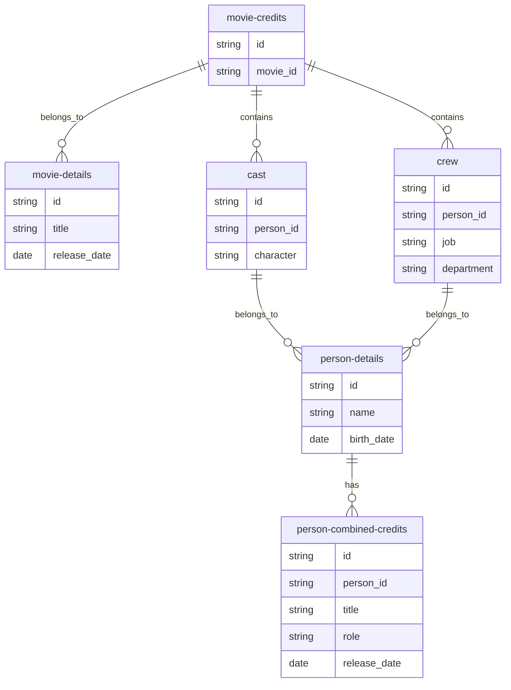

# Movie Database Configuration Documentation

This document provides comprehensive documentation for the movie database configuration implemented in `movie-db.tf`. It covers all components, modules, and their relationships within the Memovee Tama ecosystem.

## Overview

The movie database configuration integrates with The Movie Database (TMDb) API to provide comprehensive movie and person data retrieval, processing, and relationship building. This setup enables rich movie database functionality with proper rate limiting, data extraction capabilities, and seamless integration with the broader Memovee ecosystem.

## Core Components

### TMDb API Integration

The system establishes a dedicated Tama space named "Movie DB" for managing all movie database components.

- **API Endpoint Configuration**: Connects to the TMDb OpenAPI endpoint at `https://developer.themoviedb.org/openapi/64542913e1f86100738e227f`
- **Authentication**: Implements API key authentication for TMDb with validation checks at `/3/authentication`
- **Schema Handling**: Uses the TMDb OpenAPI specification to ensure compatibility with current TMDb endpoints

### Elasticsearch Integration

For querying movie database data in Elasticsearch:

- **Separate Specification**: Configures a distinct specification for movie database queries
- **API Key Authentication**: Sets up API key authentication with cluster health validation at `/_cluster/health`
- **Query Schema Integration**: Integrates with the existing Elasticsearch module's query schema

## Data Processing Modules

### Extract Nested Properties Module

The `extract-nested-properties-movie-db` module handles the extraction of nested properties from movie credits data:

- **Component**: `movie-credits` class
- **Extraction Type**: Array extraction with depth of 1
- **Target Classes**: Extracts `movie-credits.cast` and `movie-credits.crew` sub-classes
- **Functionality**: Separates cast and crew data into distinct classes for easier processing

### Crawl Modules

Multiple crawl modules are implemented to fetch detailed data:

#### Crawl Movie Credits

- **Module**: `crawl-movie-credits`
- **Purpose**: Retrieves movie credit information for movies
- **Data Flow**: 
  - Origin: `movie-details` class
  - Input Mapping: `movie-details-mapping` corpus
  - Request Relation: `get-movie-credits`
  - Response Relation: `create-movie-credits`

#### Crawl Cast Details

- **Module**: `crawl-cast-details`
- **Purpose**: Fetches detailed information for cast members
- **Data Flow**:
  - Origin: `cast` class (extracted from movie credits)
  - Input Mapping: `movie-details-cast-mapping` corpus
  - Request Relation: `get-cast-person-details`
  - Response Relation: `create-cast-person-details`

#### Crawl Crew Details

- **Module**: `crawl-crew-details`
- **Purpose**: Fetches detailed information for crew members
- **Data Flow**:
  - Origin: `crew` class (extracted from movie credits)
  - Input Mapping: `movie-details-crew-mapping` corpus
  - Request Relation: `get-crew-person-details`
  - Response Relation: `create-crew-person-details`

#### Crawl Person Credits

- **Module**: `crawl-person-credits`
- **Purpose**: Retrieves combined credits for people
- **Data Flow**:
  - Origin: `person-details` class
  - Input Mapping: `person-details-mapping` corpus
  - Request Relation: `get-person-combined-credits`
  - Response Relation: `create-person-combined-credits`

## Relationship Building Modules

### Network Movie Credits

- **Module**: `network-movie-credits`
- **Class IDs**: `movie-credits` class
- **Can Belong To**: `movie-details` class
- **Functionality**: Establishes relationships between movie credits and their parent movie details

### Network Cast and Crew

- **Module**: `network-cast-and-crew`
- **Class IDs**: `cast` and `crew` classes (extracted from movie credits)
- **Can Belong To**: `movie-credits` class
- **Functionality**: Builds relationships between cast/crew data and movie credits

### Network Person Details

- **Module**: `network-person-details`
- **Class IDs**: `person-details` class
- **Can Belong To**: `cast` and `crew` classes
- **Functionality**: Connects person details to their respective cast and crew entries

### Network Person Credits

- **Module**: `network-person-credits`
- **Class IDs**: `person-combined-credits` class
- **Can Belong To**: `person-details` class
- **Functionality**: Links person details to their combined credits for comprehensive filmography

## Rate Limiting

### Source Limit Configuration

- **Module**: `tama_source_limit`
- **Rate Control**: Limits TMDb API requests to 40 requests per second
- **Purpose**: Ensures compliance with TMDb API rate limits while maintaining efficient data collection

## Entity Relationship Diagram

The following Mermaid diagram illustrates the entity relationships in the movie database configuration:

## Module Dependencies

All modules in this configuration:
- Depend on the global module for shared functionality
- Are configured to work within the Movie DB space
- Follow the established architectural patterns for consistency
- Support the comprehensive movie database integration workflow

## Integration Benefits

This configuration enables:
- Comprehensive movie database integration with proper rate limiting
- Advanced data extraction capabilities from nested structures
- Robust relationship building between entities
- Seamless integration with the broader Memovee Tama ecosystem
- Efficient data processing through specialized modules