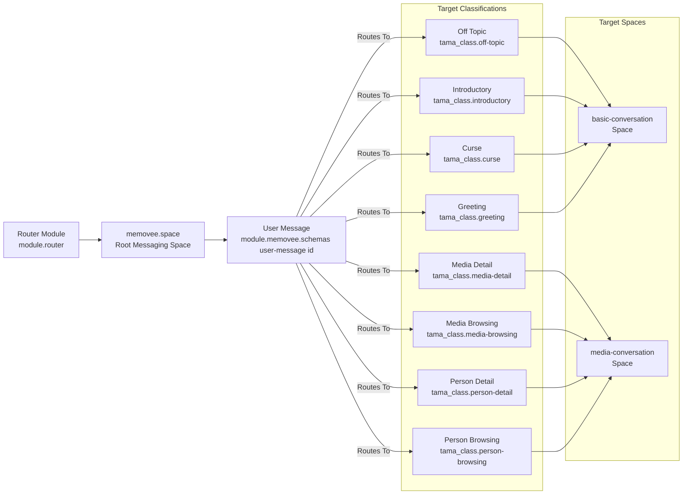

# Router Module Documentation

## Overview

The router module is a core component of the Memovee system responsible for intelligently routing user messages to appropriate classification handlers based on message content and semantics.

## Architecture Diagram

## Routing Configuration

The router is configured to handle messages from the `user-message` class and route them to the following target classes:

- **Off Topic** - Belongs to `basic-conversation` space
- **Introductory** - Belongs to `basic-conversation` space
- **Curse** - Belongs to `basic-conversation` space
- **Greeting** - Belongs to `basic-conversation` space
- **Media Detail** - Belongs to `media` space
- **Media Browsing** - Belongs to `media` space
- **Person Detail** - Belongs to `media` space
- **Person Browsing** - Belongs to `media` space

## Implementation Details

The router is implemented as a Tama module with the following key components:

- **Module Source**: `upmaru/base/tama//modules/router`
- **Version**: `0.4.8`
- **Root Messaging Space**: `module.memovee.space.id`
- **Network Message Thought**: `module.memovee.network_message_thought_id`
- **Message Routing Class**: `module.global.schemas["message-routing"].id`

Each routing path is defined using `tama_thought_path` resources that connect the router's routing thought to the target classification classes.

## Usage

The router processes incoming user messages and categorizes them into appropriate topics based on the message content. This allows for intelligent handling and processing of different types of conversations within the Memovee system.

The routing mechanism enables the system to:
- Identify conversation topics
- Route messages to specialized handlers
- Maintain organized message flow
- Support multi-domain classification (basic conversation, media, person domains)

## Classes and Spaces Mapping

- `off-topic` → `basic-conversation` space
- `introductory` → `basic-conversation` space
- `curse` → `basic-conversation` space
- `greeting` → `basic-conversation` space
- `media-detail` → `media` space
- `media-browsing` → `media` space
- `person-detail` → `media` space
- `person-browsing` → `media` space

This setup enables the system to efficiently sort and process various types of user messages according to their semantic content while maintaining proper organization across different functional domains.
